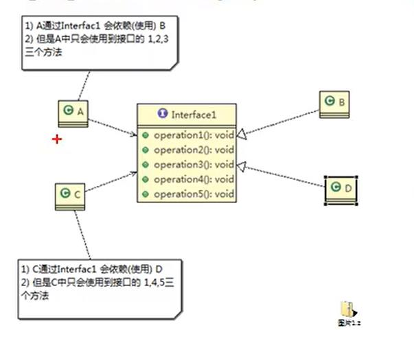

## 接口隔离原则
* ### 基本介绍
1. 客户端不应该依赖它不需要的接口,即一个类对另一个类的依赖,应该建立在最小的接口上
2. 先看一张图 <br />
   <br />
3. 类A 通过接口Interface1依赖类B,类C通过接口Interface1依赖类D,如果接口interface1对于类A 和类C 来说不是最小接口那么类B和类D必须去实现他们不需要的方法
4. 按隔离原则应当这样处理:将接口Interface1拆分为独立的几个接口,类A和类C分别与他们需要的接口建立依赖关系,也就是采用接口隔离原则
   
* ### 代码演示
> 方案1
```java
interface Interface1 {
    void operation1();
    void operation2();
    void operation3();
    void operation4();
    void operation5();
}

class B implements Interface1 {

    public void operation1(){
        System.out.println("B 实现了operation1")
    }
    public void operation2(){
        System.out.println("B 实现了operation2")
    }
    public void operation3(){
        System.out.println("B 实现了operation3")
    }
    public void operation4(){
        System.out.println("B 实现了operation4")
    }
    public void operation5(){
        System.out.println("B 实现了operation5")
    }
}
class D implements Interface1 {

    public void operation1(){
        System.out.println("D 实现了operation1")
    }
    public void operation2(){
        System.out.println("D 实现了operation2")
    }
    public void operation3(){
        System.out.println("D 实现了operation3")
    }
    public void operation4(){
        System.out.println("D 实现了operation4")
    }
    public void operation5(){
        System.out.println("D 实现了operation5")
    }
}

class A{
    public void depend1(Interface1 i){
        i.operation1();
    }
    public void depend2(Interface1 i){
        i.operation2();
    }
    public void depend3(Interface1 i){
        i.operation3();
    }
}

class C{
    public void depend1(Interface1 i){
        i.operation1();
    }
    public void depend4(Interface1 i){
        i.operation4();
    }
    public void depend5(Interface1 i){
        i.operation5();
    }
}
```
```
分析方案1:
1.类A通过Interface1接口依赖了类B中operation123,在实现类B中,还有operation45方法,在类A中没有用到,同理类D中实现的operation23方法,类C中也没有用到,这样就写了很多无用的代码
```
> 方案2: <br />
类图演示: <br />
 <br />
```java
interface Interface1{
    void operation1();
}
interface Interface2{
    void operation2();
    void operation3();
}
interface Interface3{
    void operation3();
    void operation4();
}

class B implements Interface1,Interface2{
    public void operation1(){
        System.out.println("B 实现了operation1")
    }
    public void operation2(){
        System.out.println("B 实现了operation2")
    }
    public void operation3(){
        System.out.println("B 实现了operation3")
    }
}

class D implements Interface1,Interface3{
    public void operation1(){
        System.out.println("D 实现了operation1")
    }
    public void operation4(){
        System.out.println("D 实现了operation4")
    }
    public void operation5(){
        System.out.println("D 实现了operation5")
    }
}

class A{
    public void depend1(Interface1 i){
        i.operation1();
    }
    public void depend2(Interface2 i){
        i.operation2();
    }
    public void depend3(Interface2 i){
        i.operation3();
    }
}
class C{
    public void depend1(Interface1 i){
        i.operation1();
    }
    public void depend4(Interface3 i){
        i.operation4();
    }
    public void depend5(Interface3 i){
        i.operation5();
    }
}
```
```
分析方案2:
方案1没有使用接口隔离,在类B和类D中,每个类多实现了2个方法,造成了代码负担,
方案2,使用了代码隔离,将Interface1拆分成了3个接口,Interface1,Interface2和Interface3,类B和类D需要实现什么业务方法,就实现什么业务方法,不会造成代码负担
```