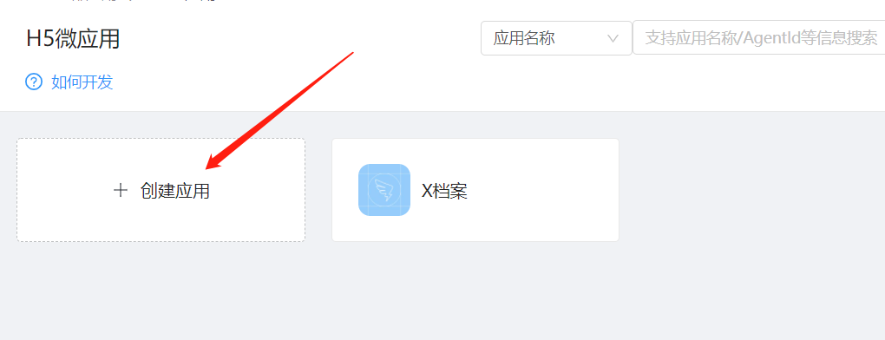
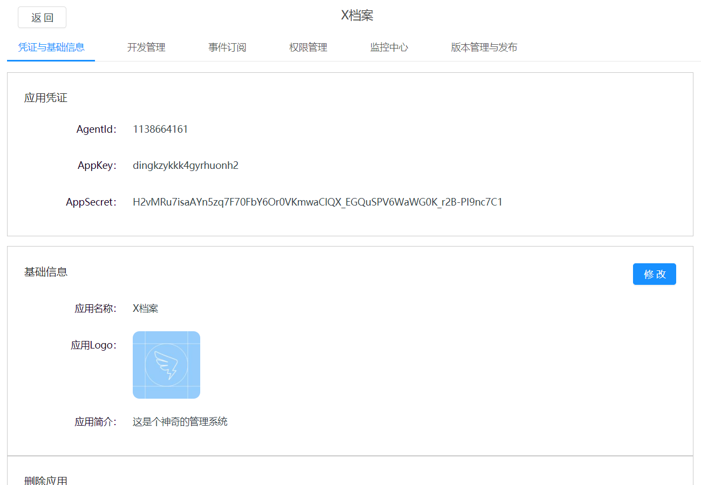
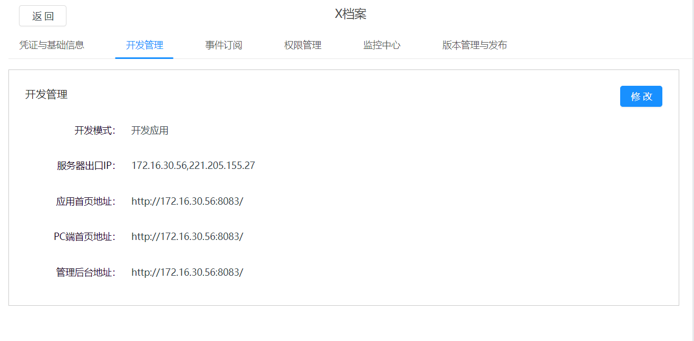
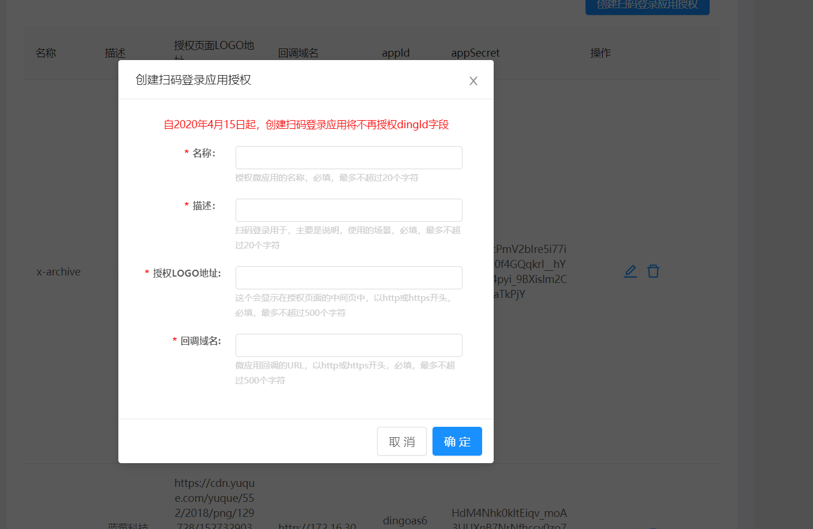
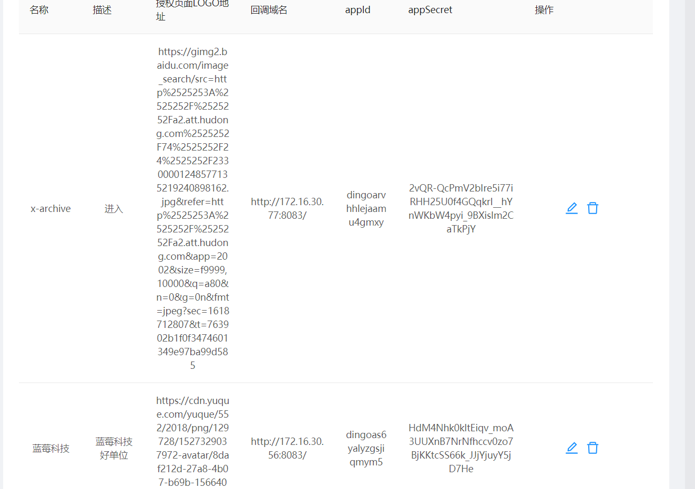

# 管理系统接入钉钉扫码登录

> ## 登录钉钉开放平台配置
 - ### 微应用配置
    1.<font color=blue>[登录地址]</font>([<](https://open-dev.dingtalk.com/)) <https://open-dev.dingtalk.com/><br />
    2.选择 (企业内部应用) 下方的<font color=blue> [小程序]</font>或者<font color=blue>[H5微应用]</font><br />
    3.如下图所示:点击创建H5微应用
     <br />
    4.如下图所示:编写信息,注意:开发方式,选择企业自助开发
     <br />
    5.生成<font color=blue>凭证与基础信息</font>,如下图
     <br />
    6.点击<font color=blue>开发管理</font>,
    ```txt
        服务器出口IP
            如果是自己电脑上开发就配置自己电脑IP4v的地址
            如果是服务器上开发,就配置服务器的IP地址
    ```
     <br />
    ```txt
        应用首页地址,PC端首页地址,管理后台地址可以配置后台管理系统的地址,但地址中的ip必须是IP4V的地址
        例如
            应用首页地址：http://172.16.30.56:8083/
            PC端首页地址：http://172.16.30.56:8083/
            管理后台地址：http://172.16.30.56:8083/
    ```
- ### 登录配置
    1.点击最下方的<font color=blue>[移动接入应用]</font>中的<font color=blue>[登录]</font>
    2.点击页面中的<font color=blue>创建扫码登录应用授权</font>按钮,来编写信息,如下图
     <br />
     <br />
> ## 接口代码编写
 - 接口测试地址 </br>
   <https://open-dev.dingtalk.com/apiExplorer?spm=a2q3p.21071111.0.0.381fHirkHirk27#/?devType=org&api=dingtalk.oapi.service.get_corp_token>
 - 获取钉钉token
  
   接口:<https://oapi.dingtalk.com/gettoken> </br>
   入参:appkey和appSecret
       注意:这里的appKey和appSecret是上边创建H5微应用的appkey和appSecret

 - 扫码登录方法和接口

    接口:<https://oapi.dingtalk.com/sns/getuserinfo_bycode></br>

    入参: code
    说明:通过这个接口来获取用户的unionid
    返参:用户的unionid</br>
    String unionid = bycodeResponse.getUserInfo().getUnionid();

    接口:<https://oapi.dingtalk.com/topapi/user/getbyunionid></br>
    入参:unionid 和 access_token(钉钉生成的token)
    返参:用户的ID
    String userid = oapiUserGetbyunionidResponse.getResult().getUserid();

    接口:<https://oapi.dingtalk.com/topapi/v2/user/get>
    入参:userid和 language(value=zh_CN)
    返参:用户的详细信息
    rspGetResponse.getBody()

    <font color=red>注意:如果是接入第三方开源框架的话,需要将钉钉的用户数据同步到第三方数据库,需要梳理字段,统一字段名称,从而调用第三方登录的业务方法生成第三方框架的token</font>


```java
@RequestMapping(value = "user/getUserInfo",method = RequestMethod.POST)
    public AjaxResult getUserInfo(@RequestBody LoginDing loginDing) {
        AjaxResult ajax = AjaxResult.success();
        Map<String, Object> map = map = new HashMap<String,Object>();
        try {
            // 通过临时授权码获取授权用户的个人信息
            DefaultDingTalkClient client2 = new DefaultDingTalkClient("https://oapi.dingtalk.com/sns/getuserinfo_bycode");
            OapiSnsGetuserinfoBycodeRequest reqBycodeRequest = new OapiSnsGetuserinfoBycodeRequest();
            // 通过扫描二维码，跳转指定的redirect_uri后，向url中追加的code临时授权码
            reqBycodeRequest.setTmpAuthCode(loginDing.getAuthCode());
            OapiSnsGetuserinfoBycodeResponse bycodeResponse = client2.execute(reqBycodeRequest, appId,appSecret);
            // 获取access_token，注意正式代码要有异常流处理
            String access_token = ding.getDToken();
            System.out.println("access_token:"+access_token);
            // 根据unionid获取userid
            String unionid = bycodeResponse.getUserInfo().getUnionid();
            DingTalkClient clientDingTalkClient = new DefaultDingTalkClient("https://oapi.dingtalk.com/topapi/user/getbyunionid");
            OapiUserGetbyunionidRequest reqGetbyunionidRequest = new OapiUserGetbyunionidRequest();
            reqGetbyunionidRequest.setUnionid(unionid);
            OapiUserGetbyunionidResponse oapiUserGetbyunionidResponse = clientDingTalkClient.execute(reqGetbyunionidRequest,access_token);


            // 根据userId获取用户信息
            String userid = oapiUserGetbyunionidResponse.getResult().getUserid();
            DingTalkClient clientDingTalkClient2 = new DefaultDingTalkClient("https://oapi.dingtalk.com/topapi/v2/user/get");
            OapiV2UserGetRequest reqGetRequest = new OapiV2UserGetRequest();
            reqGetRequest.setUserid(userid);
            reqGetRequest.setLanguage("zh_CN");
            OapiV2UserGetResponse rspGetResponse = clientDingTalkClient2.execute(reqGetRequest, access_token);
            System.out.println(rspGetResponse.getBody());

            SysUser user = userService.selectUserById(Long.parseLong(userid));
            String uuid = IdUtils.simpleUUID();
            // 生成令牌
            String token = loginService.loginDing(user.getUserName(), "admin123",uuid);
            ajax.put(Constants.TOKEN, token);


//            map.put("userInfo", rspGetResponse.getBody());
        }catch (ApiException exception){
            exception.printStackTrace();
        }

        return ajax;
    }
```

> ## 前端代码编写
- 导入钉钉的js文件</br>
  ```html
  <script src="http://g.alicdn.com/dingding/dinglogin/0.0.5/ddLogin.js"></script>
  ```
  说明:如果是自己搭建的前端,只需将ddLogin.js文件在首页的[head]标签内即可.如果前端是用的vue搭建的框架,n那么ddLogin.js需在写在public目录下index.html的[head]标签中
- 修改login.vue文件(vue框架或者是第三方若依开源框架)

  ```html
    <div id="login_container"></div>
  ```
    说明:在原来的el-form标签中插入上面的标签,注意上边的id:login_container,要和下边的对应

  ```js
    mounted() {
        let code = this.getQueryString("code");
        console.log("code----:"+code);
        if (code) {
        console.log("登录跳转")
        this.handleCodeLogin(code);
        } else {
        console.log("创建二维码")
        this.codeLogin();
        }
    }
    methods: {
        codeLogin () {
            this.appid = "dingoas6yalyzgsjiqmym5";
            this.redirect_uri = "http://172.16.30.56:8083/";
            let obj = DDLogin({
            id: 'login_container',
            // goto这里需要对url整体做一个urlencode编码
            goto: encodeURIComponent('https://oapi.dingtalk.com/connect/oauth2/sns_authorize?appid=' + this.appid + '&response_type=code&scope=snsapi_login&state=STATE&redirect_uri=' + this.redirect_uri + ''),
            style: 'border:none;background-color:#FFFFFF;',
            width: '365',
            height: '300'
            })
            let hanndleMessage = function (event) {
            let origin = event.origin
            // 判断是否来自ddLogin扫码事件
            if (origin === 'https://login.dingtalk.com') {
                let loginTmpCode = event.data
                // 这里url不用进行urlencode编码
                let url = 'https://oapi.dingtalk.com/connect/oauth2/sns_authorize?appid=' + this.appid + '&response_type=code&scope=snsapi_login&state=STATE&redirect_uri=' + this.redirect_uri + '&loginTmpCode=' + loginTmpCode
                window.location.href = url
            }
            }
            if (typeof window.addEventListener !== 'undefined') {
            window.addEventListener('message', hanndleMessage, false)
            } else if (typeof window.attachEvent !== 'undefined') {
            window.attachEvent('onmessage', hanndleMessage)
            }
        },

        handleCodeLogin(code){
            console.log("登录")
            this.loginForm.code = code;
            this.$store.dispatch("Login", this.loginForm).then(() => {
                this.$router.push({ path: this.redirect || "/" }).catch(()=>{});
            }).catch(() => {
                this.loading = false;
                this.codeLogin();
            });
        },
        getQueryString(name) {
            let url = decodeURIComponent(window.location.href);
            if(!url){
                return null;
            }
            let arr1 = url.split("?");
            console.log(arr1[2]);

            if(arr1[2] == undefined){
                return null
            }

            let arr2 = arr1[2].split("&");


            console.log(arr2);
            for(let i in arr2){
                let arr3 = arr2[i].split("=");
                if(name == arr3[0]){
                    return arr3[1];
                }
            }

            return null;
        }
    }
  ```
  说明:getQueryString()方法是从地址上回去临时授权码,是<https://oapi.dingtalk.com/sns/getuserinfo_bycode>接口的入参,handleCodeLogin(code)这个方法是扫码成功后登录的方法,codeLogin()这个方法是用来创建二维码的</br>
- 修改store->modules->user.js
  ```js
    actions: {
    // 登录
    Login({ commit }, userInfo) {
      const code = userInfo.code;
      return new Promise((resolve, reject) => {
        console.log("code-------:"+code)
        LoginByErWeiMa({authCode:code}).then(res=>{
          console.log("res.toke:"+res.token);
          setToken(res.token)
          commit('SET_TOKEN', res.token)
          resolve()
        }).catch(error=>{
          reject(error)
        })
      })
    }
  ``` 


